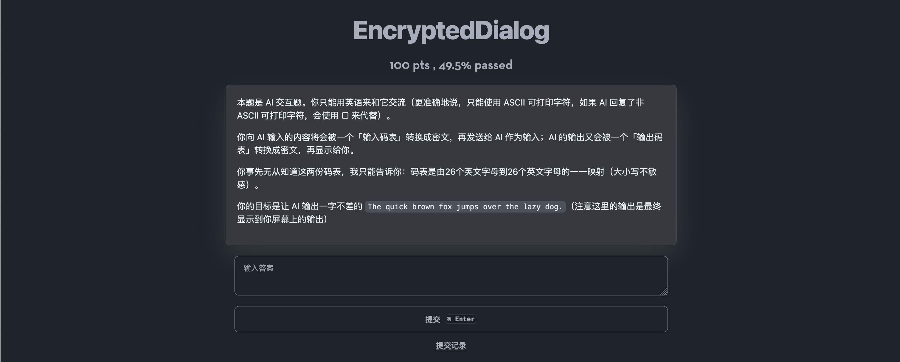

# Mijie

Mijie 是一个网络解谜游戏网站，提供了非常多样的游戏形式，解谜爱好者可以使用 Mijie 举办丰富多彩的解谜游戏。

支持流程图、排行榜、公告、提交记录等多种功能。

> 本项目最初是为了在 2023 年北京邮电大学百团大战中举办的解谜游戏“哈士奇再现”而开发的。在那之后，2024 年百团大战的解谜游戏 “哈士奇的复仇”、哈士奇壬寅年解谜游戏和癸卯年解谜游戏也使用了 Mijie。

## 预览

基础的提交答案类题目：

也可以使用 Vue.js 来编写题面：

## 环境变量

1. `MONGODB_URI`：MongoDB 连接 URL
2. `JWT_SECRET`：JWT 密钥
3. `API_PORT`：API 服务端口
4. `GLOT_IO_API_KEY`：Glot.io API 密钥
5. `ABLY_ADMIN_KEY`：Ably Admin 密钥
6. `ABLY_PUBLIC_KEY`：Ably Public 密钥
7. `CLOUDFLARE_API_KEYS`：Cloudflare API 密钥，用于调用 Cloudflare AI
8. `ZHIPU_API_KEY`：智谱 API 密钥，用于调用智谱 AI。当 `CLOUDFLARE_API_KEYS` 不为空时，此项无效，会优先使用 Cloudflare AI
9. `TURNSTILE_KEY`：Turnstile Key
10. `TURNSTILE_SECRET`：Turnstile Secret