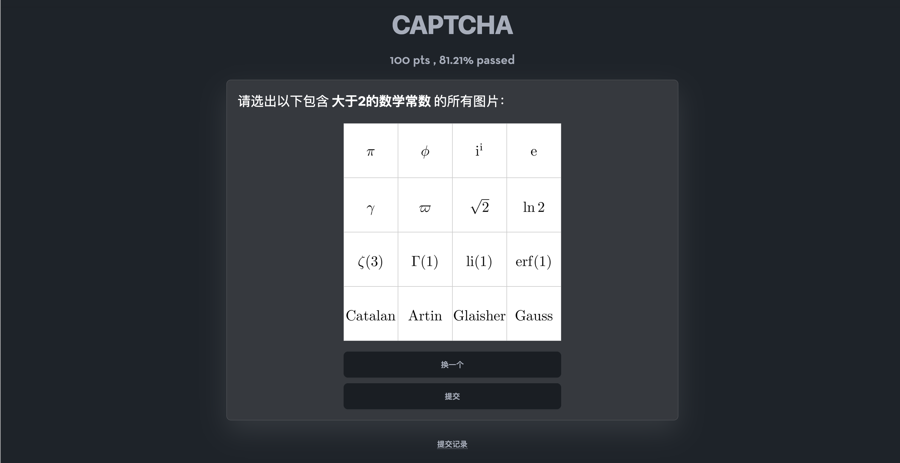

# Mijie

Mijie 是一个网络解谜游戏网站，提供自由度极高的题目形式，支持流程图、排行榜、公告、提交记录等多种功能。解谜爱好者可以使用 Mijie 快速搭建自己的网络解谜游戏网站。

> 本项目最初是为了在 2023 年北京邮电大学百团大战中举办的解谜游戏“哈士奇再现”而开发的。在那之后，2024 年百团大战的解谜游戏 “哈士奇的复仇”、哈士奇壬寅年解谜游戏和癸卯年解谜游戏也使用了 Mijie。

## 预览

基础的提交答案类题目：


也可以使用 Vue.js 来编写题面：



## 部署

1. Clone 本项目
2. 安装 [Bun](https://bun.sh/), [Node.js](https://nodejs.org)
3. 安装后端依赖
    ```bash
    bun install
    ```
4. 安装前端依赖
    ```bash
    cd frontend && pnpm install
    ```
5. 修改前端配置文件 `frontend/src/constants.js`
6. 构建前端
    ```bash
    pnpm run build
    ```
7. 创建 `.env` 文件，填入环境变量：
    1. `MONGODB_URI`：MongoDB 连接 URL
    2. `JWT_SECRET`：JWT 密钥
    3. `PORT`：监听端口
    4. `GLOT_IO_API_KEY`：Glot.io API 密钥
    5. `ABLY_ADMIN_KEY`：Ably Admin 密钥。若为空，则无法显示公告提醒、自动刷新排行榜
    6. `ABLY_PUBLIC_KEY`：Ably Public 密钥
    7. `CLOUDFLARE_API_KEYS`：Cloudflare API 密钥，用于调用 Cloudflare AI
    8. `ZHIPU_API_KEY`：智谱 API 密钥，用于调用智谱 AI。当 `CLOUDFLARE_API_KEYS` 不为空时，此项无效，会优先使用 Cloudflare AI
    9. `TURNSTILE_KEY`：Turnstile Key
    10. `TURNSTILE_SECRET`：Turnstile Secret。若为空，则不启用 Turnstile
8. 启动
    ```bash
    bun start
    ```
9. 访问 `http://localhost:3000` 并注册账号，第一个注册的账号会自动成为管理员

## 如何配置比赛？

### 基础配置

在 `/admin` 页面设置比赛开始时间、结束时间、游戏规则、游戏结束文本和关于信息：

1. 若比赛未开始，用户点击开始游戏时会提示查看游戏规则。如果想要公开开始时间，可以在游戏规则中说明。
2. 若比赛已结束，用户将无法提交题目。如果不是限时比赛，可以将结束时间设置为一个非常大的值。
3. 游戏规则会在用户第一次点击开始游戏时显示，请将比较重要的规则放在这里。
    
4. 游戏结束文本会在用户通过带有 `gameover` 属性的题目后显示。此处可以使用 [ejs](https://ejs.co/) 模板语法，例如 `<%= username %>` 会被替换为用户的用户名。目前支持的模板变量有：
    ```typescript
    type TemplateVariables = {
        username: string;
        passed: {
            [pid: string]: number
        };
        plugins: Map<string, Plugin>;
    };
    ```
    例如：
    ```markdown
    你好，<%= username %>！恭喜你通过了这些题目：
    <% for (const pid of Object.keys(passed)) { %>
    - <%= plugins.get(pid).name  %> （得分 <%= passed[pid]  %> )
    <% } %>
    ```
    
5. 关于信息会在 `/about` 页面显示。通常而言，这里可以放置比赛相关信息以及联系方式等。
    

### 题目配置

所有题目的配置文件都存放在 `game` 目录下。每个题目单独一个文件夹，文件夹的名称任意，文件夹下必须包含一个 `index.js` 或 `index.ts` 文件，用于定义题目的配置。

例如[预览](#预览)中的 `EncryptedDialog` 题目的配置文件如下：

```typescript
import { createPlugin } from "../../src/types";
import { generateShuffleMap } from "./lib";

export default createPlugin({
    name: 'EncryptedDialog',
    pid: "EncryptedDialog",
    description: {
        before_solve: {
            md: "problem.md"
        }
    },
    next: [{ pid: 'entrance' }],
    points: 100,
    async checker(ans, ctx) {
        const isAscii = (x: string) => x.split('').every(c => c.charCodeAt(0) >= 32 && c.charCodeAt(0) <= 126 || c === '\n')
        if (!ans.split('').every(isAscii)) {
            ctx.msg("你的输入中包含了非 ASCII 可打印字符，请重新输入。")
            return false
        }
        let inputMap = ctx.gameStorage.get('inputMap')
        let outputMap = ctx.gameStorage.get('outputMap')
        if (!inputMap || !outputMap) {
            inputMap = generateShuffleMap()
            outputMap = generateShuffleMap()
            ctx.gameStorage.set('inputMap', inputMap)
            ctx.gameStorage.set('outputMap', outputMap)
        }
        const input = ans.split('').map(c => (inputMap as any)[c] || c).join('')
        const res = await ctx.ai([
            { "role": "system", "content": "You should only use English for chat with the user. To be more precisely, you can only output the ASCII printable characters." },
            { "role": "user", "content": input },
        ])
        if (res.success) {
            const reply = res?.response || ''
            console.log('<-', input)
            console.log('->', reply)
            const output = reply.split('').map((c: any) => isAscii(c) ? ((outputMap as any)[c] || c) : '□').join('')
            ctx.msg(output)
            return output === "The quick brown fox jumps over the lazy dog."
        }
        ctx.msg("AI 响应出现异常，请稍后重试。如果多次出现此问题，请联系管理员。")
        return false
    }
})
```

在这个题目的文件夹下，除了 `index.ts` 文件，还包含：

- `lib.ts`：该题目的辅助函数，用于随机生成字母对应表；
- `lib.test.ts`：使用 `bun:test` 的单元测试文件，可以使用 `bun test` 运行所有题目的单元测试；
- `problem.md`：题目描述的 Markdown 文件.

`createPlugin` 函数接受一个对象作为参数，对象的类型详见 [src/types.ts](./src/types.ts)。你也可以在 [game](./game) 目录下的题目和其他分支的 [game](./game) 目录下的题目中找到更多示例（但其他分支的题目的类型可能已经过时）。

#### `pid`

`pid` 是题目的唯一标识符，用于数据库和 URL 中，请确保每个题目的 `pid` 不同。

```typescript
export default createPlugin({
    name: 'Entrance',
    // ...
})
```

#### `name`

`name` 是题目的名称，会显示给用户。

```typescript
export default createPlugin({
    name: '推陈出新',
    // ...
})
```

#### `captcha`

当 `captcha` 为 `false` 时，该题目的提交不会触发验证码。

#### `points`

定义通过题目后获得的分数。

#### `manualScores`

当 `manualScores` 为 `true` 时，该题目的分数需要管理员手动设置。一般用于现场赛。

#### `first`

当 `first` 为 `true` 时，用户点击“开始游戏”后会直接跳转到该题目。

#### `gameover`

当 `gameover` 为 `true` 时，用户通过该题目后会显示游戏结束文本并设置游戏状态为通关。

#### `hints`

```typescript
hints?: Array<{
    uid: string,
    content: string
}>
```

`hints` 是一个数组，包含了用户在解题过程中可以查看的提示。数组中的每个元素是一个对象，包含了 `uid` 字段和 `content` 字段。

当用户访问 `/hint?uid=<uid>` 时，会跳转到对应的题目并显示对应的提示。但该提示只保存在浏览器中，若登出或清除浏览器缓存，提示会消失。

```typescript
export default createPlugin({
    hints: [{
        uid: "604D19B7-BEBD-41C8-B92B-5CE8A355C12F",
        content: "试着随便交点什么？"
    }],
    // ...
})
```


此项功能可以用于多个题目之间的联动，例如在通过题目 A 后解锁题目 B 的提示。

#### `files`

```typescript
files?: Array<{
    filename: string,
    info?: string
}>
```

`files` 是一个数组，包含了用户在解题过程中可以下载的文件。数组中的每个元素是一个对象，包含了 `filename` 字段和 `info` 字段。

```typescript
export default createPlugin({
    files: [{
        filename: "problem.pdf", // 相对于题目文件夹
        info: "下载题目描述"
    }],
    // ...
})
```


#### `next`

`next` 是一个数组，包含了用户通过该题目后可以解锁的题目。数组中的每个元素是一个对象，包含了 `pid` 字段以及可选的 `description` 字段。

```typescript
export default createPlugin({
    next: [
        { pid: 'CountLightsOut', description: "建议你试试这道题" },
        { pid: 'CatchGlowworm' },
        { pid: 'EncryptedDialog' },
        { pid: 'BesiegeWithoutAssault' },
        { pid: 'DigitalCircuit' }
    ],
    // ...
})
```

如果没有任何题目的 `next` 包含当前题目的 `pid`，那么用户可以直接通过 URL 访问该题目，但该题目不会显示在流程图中。

#### `record`

`record` 是一个布尔值，表示是否允许用户查看提交记录。无论是否允许查看提交记录，管理员都可以查看。

#### `inputs` 和 `checker`

`inputs` 和 `checker` 用于定义题目的检查逻辑。

`inputs` 有以下几种取值：

1. `false`：不需要用户输入。当设置为 `false` 时，题目界面不显示输入框和提交按钮。适合用于交互题或其他不需要用户输入的题目。此时不能设置 `checker`。
2. `true` 或不设置：需要用户输入一个值。当设置为 `true` 时，题目界面显示一个输入框和提交按钮。`checker` 函数的第一个参数类型为字符串，表示用户的输入。

3. `{ name: string; placeholder: string }[]`：需要用户输入多个值。当设置为一个数组时，题目界面会显示多个输入框，可以指定每个输入框的 placeholder。`checker` 函数的第一个参数类型为一个对象，键为输入框的 `name`，值为用户的输入。
    

`checker` 函数返回值为一个布尔值，表示用户是否通过了题目。第二个参数 `ctx` 类型如下：

```typescript
export type Context = {
    username: string,
    gameProcess: InstanceType<typeof GameProcess>,
    gameStorage: Awaited<ReturnType<InstanceType<typeof GameStorage>['game']>>,
    msg: (str: string) => void,
    content: (str: string) => void
    // 一些工具函数被省略
}
```

其中：
1. `username` 是用户的用户名；
2. `msg` 函数用于向用户发送该提交的反馈信息；
3. `content` 函数用于重新设置题面。

例如：

```typescript
export default createPlugin({
    inputs: [
        { name: "x", placeholder: "请输入 x" },
    ],
    checker(ans, ctx) {
        ctx.msg(`你输入的是 ${ans.x}`)
        ctx.content("再试一次")
        return ans.x === "42"
    }
})
```


`gameProcess` 的类型如下：

```typescript
export class GameProcess {
    /**
     * `passed` 是一个对象，记录了用户通过的题目和得分。
     * ```json
     * {
     *   "level1": 100, // pid 为 level1 的题目通过了，且得分 100
     *   "level2": 50, // pid 为 level2 的题目通过了，且得分 50
     * }
     * ```
     */
    readonly passed: Record<string, number> = {};
    readonly gameover: boolean;
}
```

`gameStorage` 是一个 Key-Value 存储，每个用户每个题目都有一个独立的存储空间。`gameStorage` 的类型如下：

```typescript
type GameStorage = {
    get<T = any>(key: string): Promise<T | null>,
    set(key: string, value: any): Promise<void>,
    delete(key: string): Promise<void>,
    clear(): Promise<void>
}
```

#### `description` 和 `server`

`description` 是一个对象，包含了题目的描述，包括 `before_solve`、`after_solve` 和 `admin` 三个字段，分别对应用户在解题前、解题后的题面以及管理员用于调试题目的前端页面。

```typescript
type Description = {
    before_solve: {
        mdv?: {
            main: string,
            include?: string[],
            exclude?: string[]
        },
        md?: string,
        content?: string
    },
    after_solve?: {
        mdv?: {
            main: string,
            include?: string[],
            exclude?: string[]
        },
        md?: string,
        content?: string
    },
    admin?: {
        main: string,
        include?: string[],
        exclude?: string[]
    }
}
```

对于 `before_solve` 和 `after_solve`，可以使用 `content` 字段直接填写 Markdown 文本，也可以使用 `md` 字段填写 Markdown 文件的路径（相对于题目文件夹）：

```typescript
// game/test/index.ts
export default createPlugin({
    pid: "test",
    name: '测试题目',
    description: {
        before_solve: {
            md: "problem.md" // game/test/problem.md
        },
        after_solve: {
            content: "恭喜你通过了这道题目！"
        }
    },
    // ...
})
```

`before_solve` 和 `after_solve` 还可以使用 `mdv` 字段，可以使用 Markdown-Vue.js (见 [mdvc](https://github.com/youXam/mdvc)) 编写题面。

```typescript
// game/test/index.ts
export default createPlugin({
    description: {
        before_solve: {
            mdv: {
                // 主文件
                main: "app/main.md",
                // 允许前端引入的文件
                include: ["app/**/*"]
            }
        },
    }
})
```

```markdown
<!-- game/test/app/main.md -->
在平面直角坐标系中，敌军的初始位置是 $(0,0)$，你可以选择任意一个位置，向敌军发动突袭。

突袭开始后，敌军总是朝着远离你的方向移动（此运动过程通过 {{ Step }} 步的近似连续过程来模拟），你可以指定任意位置进行移动。你与敌军的速度之比为 $1:0.95$。

你需要做到「围而不攻」，既不能过分靠近敌军（距离 $d<=1$），又不能让敌军逃出包围圈（$x^{2}+y^{2}<=10^2$）的范围。

当敌军累计走过的路线长度达到 $95$ 时，你的任务完成。

<App />

<script setup>
import App from './App.vue'
import { Step } from './lib.ts'
</script>
```

`admin` 字段同样指定 mdv 组件，只有管理员查看该题目的时候才会显示：

```typescript
// game/test/index.ts
export default createPlugin({
    description: {
        before_solve: {
            content: "别看我，我也一脸茫然..."
        },
        admin: {
            main: "admin.vue",
            include: ["admin.vue"]
        }
    },
    // ...
})
```

```html
<!-- game/test/admin.vue -->
<template>
    <button @click="reset">{{ text }}</button>
</template>

<script setup>
import { inject, ref } from 'vue'
const text = ref('重置回合')
const api = inject('admin_api') // 用于调用后端 API
async function reset() {
    text.value = await api('reset')
    setTimeout(() => text.value = '重置回合', 1000)
}
</script>
```


通过上面的示例配置，可以发现使用 `mdv` 可以使用 Vue.js 编写交互式题目。为了方便地进行前后端通信，在挂载普通组件时会注入一个 `api` 函数，在挂载 admin 组件时会注入一个 `admin_api` 函数，用于调用后端 API。

题目配置中可以使用 `server` 字段来编写交互逻辑：

```typescript
export default createPlugin({
    server(app) {
        app.on('init', (_, ctx) => {
            const cells = Array.from({ length: 36 }, () => Math.random() > 0.5)
            ctx.gameStorage.set("cells", cells)
            return cells.reduce((acc, cur) => acc + (cur ? 1 : 0), 0)
        })
        app.on('toggle', (index: number, ctx) => {
            const cells = ctx.gameStorage.get<Array<boolean>>("cells")
            if (!cells) return
            const row = Math.floor(index / 6), col = index % 6;
            [
                [row, col],
                [row - 1, col],
                [row + 1, col],
                [row, col - 1],
                [row, col + 1],
            ].forEach(([r, c]) => {
                if (r >= 0 && r < 6 && c >= 0 && c < 6) {
                    cells[r * 6 + c] = !cells[r * 6 + c]
                }
            })
            ctx.gameStorage.set("cells", cells)
            if (cells.every(x => !x)) {
                ctx.pass()
            }
            return cells.reduce((acc, cur) => acc + (cur ? 1 : 0), 0)
        })
    },
    // ...
})
```

前端使用 `inject("api")` 函数获取 `api` 函数，调用后端 API：

```html
<script setup>
import { inject } from 'vue';
const api = inject("api");
api("init").then(data => {
    num.value = data
    inited.value = true
})
function handleClick(index) {
    const result = api("toggle", index)
    // ...
}
</script>
```

`api` 函数接受两个参数，第一个参数是事件名，第二个参数是事件的参数，可以为任意类型。`api` 函数返回一个 Promise，包裹了后端返回的数据。后端可以使用 `app.on('event_name', (data, ctx)` 来监听事件，其中 `data` 是前端传来的参数，`ctx` 和 `checker` 中的对象类似，但有两个不同：

```typescript
export type ServerContext = {
    username: string,
    gameProcess: InstanceType<typeof GameProcess>,
    gameStorage: Awaited<ReturnType<InstanceType<typeof GameStorage>['game']>>,
    pass: (str?: string) => void,
    nopass: (str?: string) => void
    // 一些工具函数被省略
}
```

调用 `pass` 函数表示通过题目，调用 `nopass` 函数表示未通过题目，两个函数都可以传入一个字符串作为提示信息。